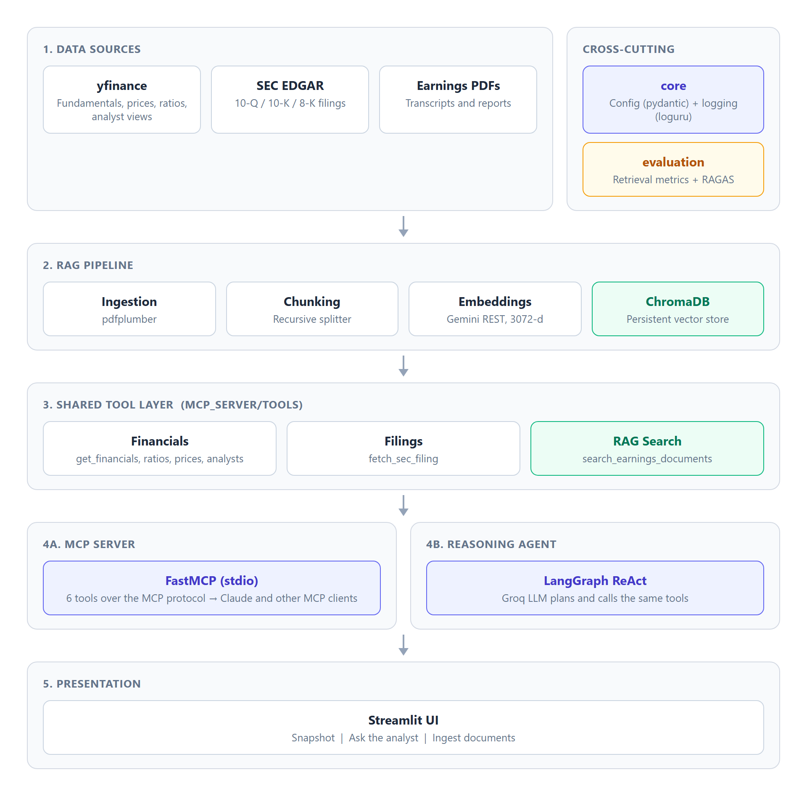
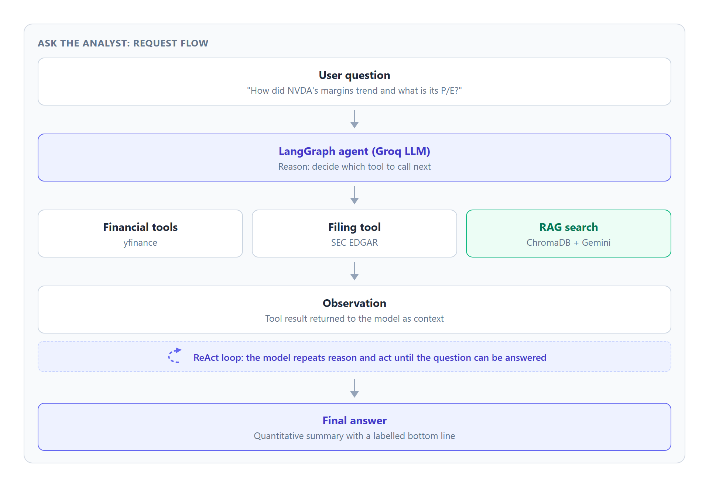
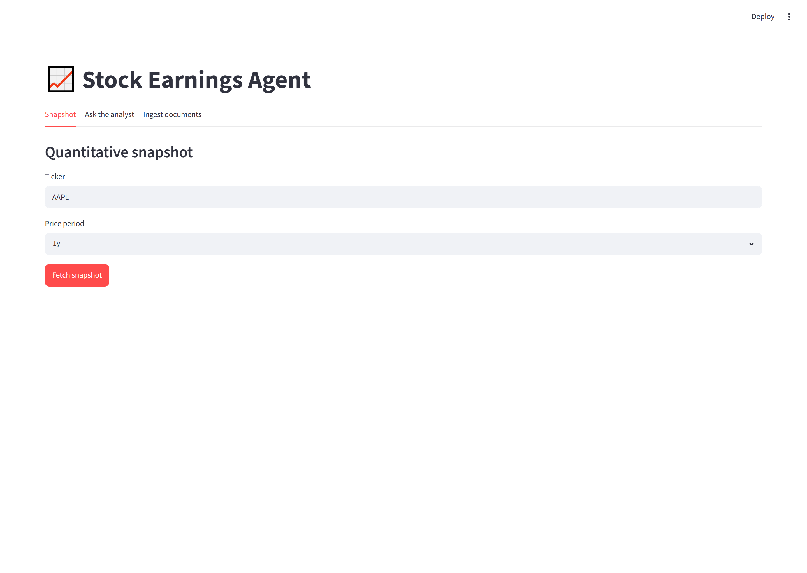
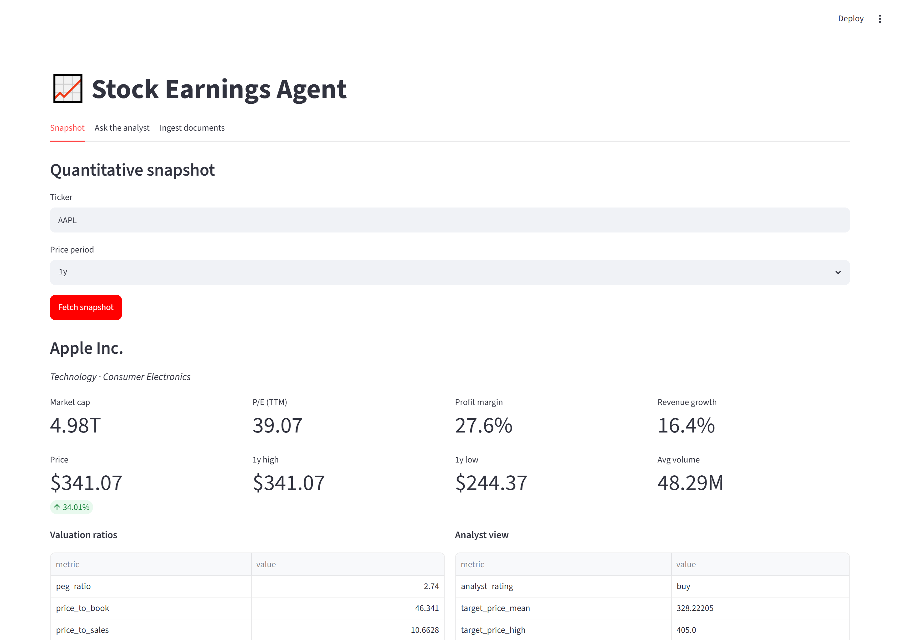
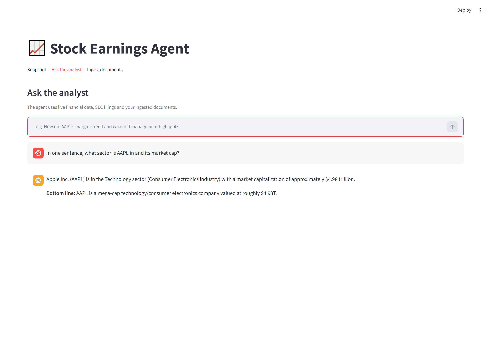
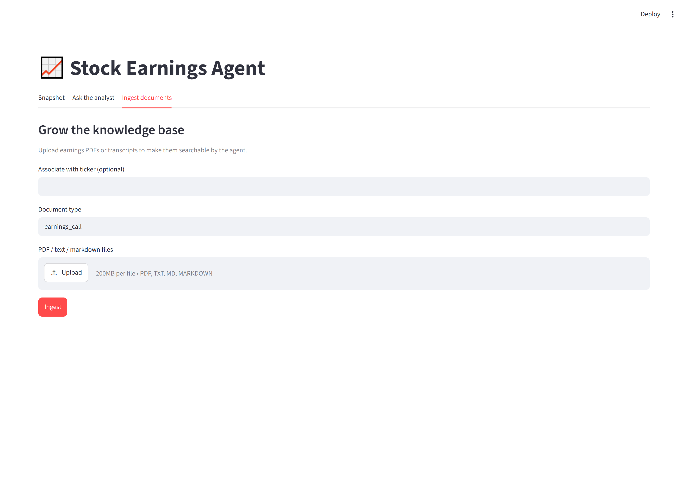
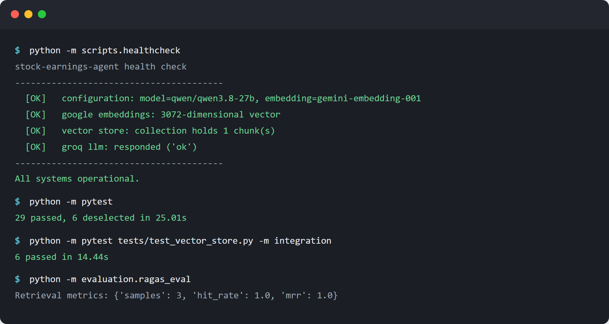

# Stock Earnings Agent

### Project Documentation

**Version:** 1.0  **Date:** September 2026  **Status:** Production ready

---

## 1. Overview

Stock Earnings Agent is an equity research assistant that answers questions about
public companies by combining three sources of truth: live market data, official
regulatory filings, and a searchable library of earnings documents. It reasons
over these sources with a large language model and presents results through two
interfaces: an interactive web application and a Model Context Protocol (MCP)
server that any MCP compatible client can call.

The system is built as a set of clearly separated layers so that the same tested
business logic serves both the web application and the MCP server, with no
duplicated code.

---

## 2. Problem Statement

Analysing a company's earnings is slow and fragmented. An analyst typically has
to:

1. Pull quantitative metrics (revenue, margins, valuation ratios) from one
   source.
2. Read qualitative commentary (management discussion, guidance, risk factors)
   from official filings in another place.
3. Manually reconcile the numbers with the narrative to form a view.

These steps live in different tools, use different formats, and require repeated
manual effort for every company and every quarter. There is no single interface
that retrieves the numbers, retrieves the relevant text, and reasons over both
together.

**Goal:** provide one system that gathers the quantitative and qualitative
evidence for a company, retrieves the most relevant passages from earnings
documents, and produces a grounded, cited analysis, available both as a web
application and as callable tools for an AI assistant.

---

## 3. Objectives

| # | Objective | Outcome |
|---|-----------|---------|
| 1 | Aggregate live financial data | Fundamentals, prices, ratios and analyst views from a single tool set |
| 2 | Access official filings | On demand retrieval of 10-Q, 10-K and 8-K documents from SEC EDGAR |
| 3 | Search earnings documents | Retrieval augmented generation over ingested PDFs and transcripts |
| 4 | Reason over the evidence | A tool calling agent that plans, retrieves, and answers |
| 5 | Expose tools to AI clients | An MCP server that reuses the same logic |
| 6 | Measure retrieval quality | An evaluation harness with retrieval and generation metrics |
| 7 | Ship to production standard | Typed configuration, logging, tests, linting and containerisation |

---

## 4. Solution Overview

The solution is organised into five layers plus two cross cutting concerns.

- **Data sources** provide raw inputs: market data, filings, and documents.
- **RAG pipeline** converts documents into a searchable vector index.
- **Shared tool layer** holds the business logic as plain functions.
- **Consumers** are the MCP server and the reasoning agent, which both call the
  shared tools.
- **Presentation** is the web application.

The two cross cutting concerns are **core** (configuration and logging) and
**evaluation** (quality measurement).

---

## 5. System Architecture

The diagram below shows the layered design and how data flows from raw sources
to the user. The shared tool layer is the key design decision: both the MCP
server and the agent depend on it, so logic is written and tested once.



**Design principles**

- **Single source of business logic.** Financial, filing and retrieval logic
  live in `mcp_server/tools/` as framework neutral functions. The MCP server and
  the agent are thin adapters over them.
- **Predictable failure.** Tool functions never raise for expected problems such
  as a bad ticker or a network error. They return a structured `{"error": ...}`
  value so callers can reason about it.
- **Configuration in one place.** All settings are validated once at startup
  through a typed settings object.
- **Logs to standard error.** The MCP protocol uses standard output, so all logs
  are written to standard error to keep the protocol stream clean.

---

## 6. Technology Stack

Every dependency is chosen for a specific role. Links point to the official
documentation.

| Area | Technology | Role |
|------|-----------|------|
| Language | [Python 3.11+](https://www.python.org/) | Implementation language (validated on 3.13) |
| LLM inference | [Groq](https://console.groq.com/docs) | Fast hosted inference for the reasoning model |
| Agent framework | [LangGraph](https://langchain-ai.github.io/langgraph/) | Stateful tool calling ReAct agent |
| LLM integration | [LangChain](https://python.langchain.com/) | Tool and model abstractions |
| Embeddings | [Google Gemini Embeddings](https://ai.google.dev/gemini-api/docs/embeddings) | 3072 dimensional text vectors via REST |
| Vector store | [ChromaDB](https://docs.trychroma.com/) | Local persistent similarity search |
| Tool protocol | [Model Context Protocol](https://modelcontextprotocol.io/) via [FastMCP](https://github.com/jlowin/fastmcp) | Exposes tools to AI clients |
| Market data | [yfinance](https://github.com/ranaroussi/yfinance) | Fundamentals, prices, ratios, analyst views |
| Filings | [SEC EDGAR](https://www.sec.gov/os/accessing-edgar-data) | Official 10-Q, 10-K and 8-K documents |
| PDF parsing | [pdfplumber](https://github.com/jsvine/pdfplumber) | Text extraction from earnings PDFs |
| Web UI | [Streamlit](https://docs.streamlit.io/) | Interactive front end |
| Evaluation | [RAGAS](https://docs.ragas.io/) | RAG generation quality metrics |
| Configuration | [Pydantic Settings](https://docs.pydantic.dev/latest/concepts/pydantic_settings/) | Typed, validated settings |
| Logging | [Loguru](https://github.com/Delgan/loguru) | Structured application logging |
| Resilience | [Tenacity](https://tenacity.readthedocs.io/) | Retry with backoff on transient errors |
| Testing | [pytest](https://docs.pytest.org/) | Unit and integration tests |
| Linting | [Ruff](https://docs.astral.sh/ruff/) | Static analysis and formatting |

**Notable decisions**

- Embeddings are generated by direct REST calls to the Gemini API rather than
  local transformer libraries. This avoids native library incompatibilities on
  Windows with Python 3.13 and removes a heavy dependency.
- The reasoning model is configurable. The default is a tool calling model
  available on the target Groq account. It can be changed with one environment
  variable.

---

## 7. Core Components

This section explains the major pieces of the codebase. Each subsection names the
files involved and shows a short representative excerpt.

### 7.1 Configuration and logging (`core/`)

All configuration is defined once as a typed object. Validation runs at startup,
so a missing key or an invalid value fails immediately with a clear message
rather than deep inside a request.

```python
class Settings(BaseSettings):
    groq_api_key: str = Field(..., description="API key for Groq inference.")
    google_api_key: str = Field(..., description="API key for embeddings.")
    groq_model: str = Field("qwen/qwen3.8-27b")   # must support tool calling
    embedding_model: str = Field("gemini-embedding-001")
    embedding_dimension: int = Field(3072, gt=0)
    chunk_size: int = Field(1000, gt=0)
    retrieval_top_k: int = Field(5, gt=0)
```

Logging is centralised in `core/logging.py` and writes to standard error, which
keeps the MCP protocol stream on standard output uncorrupted.

### 7.2 RAG pipeline (`rag_pipeline/`)

The pipeline turns documents into a searchable index and answers retrieval
queries. It is split into focused modules:

- `ingestion.py` reads PDF, text and markdown files into documents with
  provenance metadata.
- `chunking.py` splits documents into overlapping windows using a recursive
  splitter.
- `embeddings.py` calls the Gemini API to produce vectors, with batching and
  retries.
- `vector_store.py` wraps ChromaDB for persistent similarity search.
- `pipeline.py` orchestrates the write path and the read path.

The embedding client retries transient failures automatically:

```python
@retry(
    retry=retry_if_exception_type((requests.RequestException, EmbeddingError)),
    stop=stop_after_attempt(4),
    wait=wait_exponential(multiplier=1, min=1, max=10),
    reraise=True,
)
def _embed_one(self, text: str, task_type: str) -> list[float]:
    ...
```

The vector store caches one database client per path for the whole process. This
is both a correctness fix (the native core must not be opened twice for the same
path) and a performance improvement shared by the web app and the agent.

Retrieval returns ranked passages with a cosine similarity score and a citation
label so answers can be traced back to their source:

```python
def retrieve(self, query, top_k=None, ticker=None) -> list[RetrievedChunk]:
    query_embedding = self._embedder.embed_query(query)
    hits = self._store.query(query_embedding, top_k=top_k,
                             where={"ticker": ticker.upper()} if ticker else None)
    return [RetrievedChunk(text=h["text"], metadata=h["metadata"],
                           score=h["score"]) for h in hits]
```

### 7.3 Shared tool layer (`mcp_server/tools/`)

This layer holds the business logic as plain functions that return
JSON serialisable dictionaries. Every function validates its input and returns a
structured error instead of raising for expected failures.

```python
def get_financials(ticker: str) -> dict[str, Any]:
    try:
        symbol = _clean_ticker(ticker)
        info = yf.Ticker(symbol).info
    except ValueError as exc:
        return {"error": str(exc)}
    ...
    return {"ticker": symbol, "company_name": info.get("longName"),
            "pe_ratio": info.get("trailingPE"), ...}
```

The six tools are: financial fundamentals, price history, valuation ratios,
analyst recommendations, SEC filing retrieval, and semantic search over ingested
documents.

### 7.4 Reasoning agent (`agents/`)

The agent is a tool calling ReAct graph built with LangGraph. It plans, calls
tools, reads the results, and repeats until it can answer. The same shared tools
are wrapped as agent tools, so there is no second implementation.

```python
def build_agent(model=None):
    llm = get_llm(model=model)
    tools = build_agent_tools()
    return create_react_agent(llm, tools, prompt=SYSTEM_PROMPT,
                              checkpointer=MemorySaver())
```

The system prompt instructs the model to fetch data with tools before making any
claim, to cite retrieved passages, and to close with a short labelled summary.

### 7.5 MCP server (`mcp_server/server.py`)

The server is a thin adapter that registers each shared function as an MCP tool.
Business logic stays in the tool modules.

```python
@mcp.tool()
def get_financials(ticker: str) -> dict[str, Any]:
    """Fetch key fundamentals for a ticker."""
    return tools.get_financials(ticker)
```

### 7.6 Web application (`app/main.py`)

The Streamlit application has three tabs: a quantitative snapshot, a
conversational analyst backed by the agent, and a document ingestion panel that
grows the searchable library.

### 7.7 Evaluation (`evaluation/`)

Two complementary evaluators are provided. A deterministic retrieval evaluator
computes hit rate and mean reciprocal rank without using any model tokens. A
RAGAS based harness adds generation metrics such as faithfulness and answer
relevancy when an inference budget is available.

---

## 8. Request Flow: Ask the Analyst

The diagram below shows what happens when a user asks a question. The model
decides which tool to call, the tool runs, the result is fed back as context, and
the loop repeats until the model can produce a final grounded answer.



---

## 9. Application Walkthrough

### 9.1 Quantitative snapshot

The snapshot tab retrieves fundamentals, price performance, valuation ratios and
the analyst consensus for a ticker in a single view.



The result for a sample ticker is shown below.



### 9.2 Ask the analyst

The analyst tab sends the question to the reasoning agent, which calls the tools
it needs and returns a concise, grounded answer.



### 9.3 Ingest documents

The ingestion tab accepts PDF, text and markdown files, optionally tags them with
a ticker, and adds them to the searchable library.



---

## 10. Verification and Results

The screenshot below shows the health check, the test suites, and the retrieval
evaluation running successfully. The health check confirms live connectivity to
the model, the embeddings API and the vector store. Retrieval scores a perfect
hit rate and mean reciprocal rank on the seeded evaluation set.



| Check | Result |
|-------|--------|
| Health check (config, embeddings, vector store, LLM) | All operational |
| Unit tests | 29 passed |
| Integration tests | 6 passed |
| Retrieval evaluation (hit rate, MRR) | 1.0, 1.0 |
| Lint (Ruff) | Clean |

---

## 11. Testing and Quality

Testing is split into two suites for a practical reason. ChromaDB's native core
conflicts with the data frame libraries used elsewhere when both run in one
process on Windows. The vector store tests are therefore marked as integration
tests and run in their own process, while the default test run covers the rest.

- **Unit tests** mock all network access, so they run offline and quickly. They
  cover configuration validation, chunking, the embedding client, the financial
  tools, and filing retrieval.
- **Integration tests** exercise the real vector store with deterministic offline
  embeddings.
- **Static analysis** with Ruff enforces a consistent style and catches common
  errors.

---

## 12. Deployment

The application ships with a container image. Dependencies are installed in a
cached layer, the application runs as a non root user, and a built in health
check acts as a readiness probe.

```bash
docker build -t stock-earnings-agent .
docker run --rm -p 8501:8501 --env-file .env stock-earnings-agent
```

The MCP server can be run from the same image or directly:

```bash
python -m mcp_server.server
```

Configuration is supplied entirely through environment variables, which suits
container and cloud deployment.

---

## 13. Limitations

- **Inference tier limits.** On a free hosted inference tier, output tokens per
  minute are capped. Complex multi step questions may reach that cap. A paid tier
  and a higher token limit resolve this.
- **Data source coverage.** Market data reflects what the upstream provider
  exposes and may lag or omit fields for some tickers.
- **Not financial advice.** The system produces analysis for research support,
  not investment recommendations.

---

## 14. Future Work

- Add charting and historical trend visualisation to the snapshot view.
- Support peer and sector comparison across multiple tickers.
- Add scheduled ingestion of new filings as they are published.
- Extend the evaluation set and track metrics over time.

---

## 15. References

- Model Context Protocol: https://modelcontextprotocol.io/
- FastMCP: https://github.com/jlowin/fastmcp
- LangGraph: https://langchain-ai.github.io/langgraph/
- LangChain: https://python.langchain.com/
- Groq documentation: https://console.groq.com/docs
- Google Gemini embeddings: https://ai.google.dev/gemini-api/docs/embeddings
- ChromaDB: https://docs.trychroma.com/
- Streamlit: https://docs.streamlit.io/
- yfinance: https://github.com/ranaroussi/yfinance
- SEC EDGAR access: https://www.sec.gov/os/accessing-edgar-data
- pdfplumber: https://github.com/jsvine/pdfplumber
- RAGAS: https://docs.ragas.io/
- Pydantic Settings: https://docs.pydantic.dev/latest/concepts/pydantic_settings/
- Loguru: https://github.com/Delgan/loguru
- Tenacity: https://tenacity.readthedocs.io/
- pytest: https://docs.pytest.org/
- Ruff: https://docs.astral.sh/ruff/
